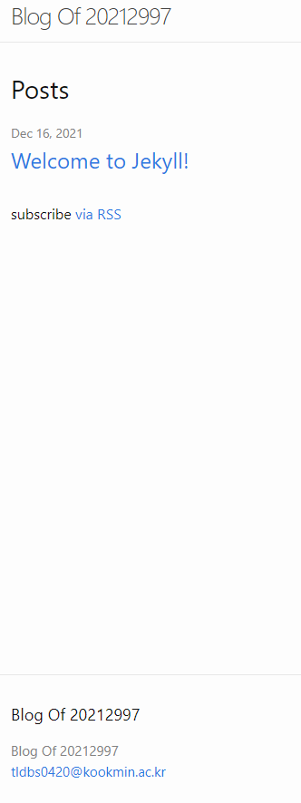
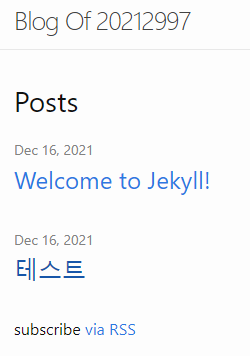

jekyll을 설치하고 jekyll new . --force (현재 디렉토리에 Jekyll 설치)를 하면 많은 파일들이 추가된다. 우리는 그 많은 파일 중에서 _config.yml과 _post 폴더를 주로 사용할 것이다.

---
_config.yml은 다음과 같은 구성으로 되어있다.
```
# Welcome to Jekyll!
#
# This config file is meant for settings that affect your whole blog, values
# which you are expected to set up once and rarely edit after that. If you find
# yourself editing this file very often, consider using Jekyll's data files
# feature for the data you need to update frequently.
#
# For technical reasons, this file is *NOT* reloaded automatically when you use
# 'bundle exec jekyll serve'. If you change this file, please restart the server process.
#
# If you need help with YAML syntax, here are some quick references for you: 
# https://learn-the-web.algonquindesign.ca/topics/markdown-yaml-cheat-sheet/#yaml
# https://learnxinyminutes.com/docs/yaml/
#
# Site settings
# These are used to personalize your new site. If you look in the HTML files,
# you will see them accessed via {{ site.title }}, {{ site.email }}, and so on.
# You can create any custom variable you would like, and they will be accessible
# in the templates via {{ site.myvariable }}.

title: Your awesome title
email: your-email@example.com
description: >- # this means to ignore newlines until "baseurl:"
  Write an awesome description for your new site here. You can edit this
  line in _config.yml. It will appear in your document head meta (for
  Google search results) and in your feed.xml site description.
baseurl: "" # the subpath of your site, e.g. /blog
url: "" # the base hostname & protocol for your site, e.g. http://example.com
twitter_username: jekyllrb
github_username:  jekyll

# Build settings
theme: minima
plugins:
  - jekyll-feed

# Exclude from processing.
# The following items will not be processed, by default.
# Any item listed under the `exclude:` key here will be automatically added to
# the internal "default list".
#
# Excluded items can be processed by explicitly listing the directories or
# their entries' file path in the `include:` list.
#
# exclude:
#   - .sass-cache/
#   - .jekyll-cache/
#   - gemfiles/
#   - Gemfile
#   - Gemfile.lock
#   - node_modules/
#   - vendor/bundle/
#   - vendor/cache/
#   - vendor/gems/
#   - vendor/ruby/
```
여기서 title, email, description 등을 수정하면 만들어질 웹사이트에 바로 반영이 된다. 따라서 다음과 같이 바꾸었다.
```
# Welcome to Jekyll!
#
# This config file is meant for settings that affect your whole blog, values
# which you are expected to set up once and rarely edit after that. If you find
# yourself editing this file very often, consider using Jekyll's data files
# feature for the data you need to update frequently.
#
# For technical reasons, this file is *NOT* reloaded automatically when you use
# 'bundle exec jekyll serve'. If you change this file, please restart the server process.
#
# If you need help with YAML syntax, here are some quick references for you: 
# https://learn-the-web.algonquindesign.ca/topics/markdown-yaml-cheat-sheet/#yaml
# https://learnxinyminutes.com/docs/yaml/
#
# Site settings
# These are used to personalize your new site. If you look in the HTML files,
# you will see them accessed via {{ site.title }}, {{ site.email }}, and so on.
# You can create any custom variable you would like, and they will be accessible
# in the templates via {{ site.myvariable }}.

title: Blog Of 20212997
email: tldbs0420@kookmin.ac.kr
description: >- # 설명
baseurl: "" # the subpath of your site, e.g. /blog
url: "" # the base hostname & protocol for your site, e.g. http://example.com
twitter_username: 
github_username:  

# Build settings
theme: minima
plugins:
  - jekyll-feed

# Exclude from processing.
# The following items will not be processed, by default.
# Any item listed under the `exclude:` key here will be automatically added to
# the internal "default list".
#
# Excluded items can be processed by explicitly listing the directories or
# their entries' file path in the `include:` list.
#
# exclude:
#   - .sass-cache/
#   - .jekyll-cache/
#   - gemfiles/
#   - Gemfile
#   - Gemfile.lock
#   - node_modules/
#   - vendor/bundle/
#   - vendor/cache/
#   - vendor/gems/
#   - vendor/ruby/
```
만들어진 jekyll을 통해 다음과 같은 코드로 웹사이트를 만들 수 있다.
> bundle exe jekyll serve

만들어진 웹사이트의 모습은 다음과 같다.

변경 사항들이 잘 적용된 모습이다.
만든 웹사이트를 github pages repo에 업로드해도 자신의 사이트에 잘 나온다.
---
post를 만들어보자. 다음과 같은 형태로 post를 만들었다.
```
2021-12-16-test.md
---
layout: post
title: "테스트"
date: 2021-12-16 0:58:35 +0900
categories: jekyll update
---
# 테스트 내용
```
위의 ---사이의 내용은 필수적이다. title로 제목을 정할 수 있다. 파일의 이름은 YYYY-MM-DD-TITLE.md의 형태로 만들어야 한다. 아래는 실행 결과이다. 만든 테스트 포스트가 생겨났다.
