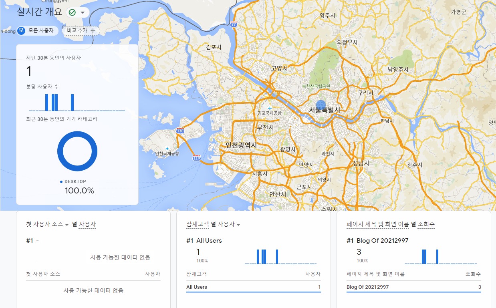

beautiful-jekyll은 이미 너무 많은 것들이 구현되어있어서 배우지 않은 기능 중 무엇을 구현할지 찾다가 Google Analytics와 블로그 연동을 하기로 결정했다. Google Analytics를 이용하면 블로그에 온 사람들의 수, 즉 조회수를 알 수 있다.
Google Analytics를 이용하기 위해 다음 두개의 사이트를 참고했다.
> https://kim-eun-ji.github.io/etc/2021-05-18-ga/
> https://infiduk.github.io/2019/11/05/google-analytics.html

먼저 Google Analytics에 가입하여 다음과 같은 과정을 진행한다.
1. Google Analytics 가입
2. 세부정보와 데이터 권한 등 설정
3. 통계 플랫폼 웹으로 선택

Google Analytics에 가입을 하면 관리>데이터 스트림>(이름)>태그하기에 대한 안내> 새로운 온페이지 태그 추가 > '전체 사이트 태그(gtag.js) 웹사이트 작성 도구 또는 CMS에서 호스팅하는 사이트를 사용하는 경우 이 태그 사용' 선택 의 과정을 순서대로 하면 다음과 같은 코드를 얻을 수 있다.

이제 이 내용을 어디에 넣을지가 문제이다. 고민 끝에 메인 화면을 구상하는 home.html에 넣어보기로 하였다. _layouts의 home.html에 다음과 같이 내용을 추가하였다.
```
...

<!-- Global site tag (gtag.js) - Google Analytics -->
<script async src="https://www.googletagmanager.com/gtag/js?id=G-R7BE0VSPX3"></script>
<script>
  window.dataLayer = window.dataLayer || [];
  function gtag(){dataLayer.push(arguments);}
  gtag('js', new Date());

  gtag('config', 'G-R7BE0VSPX3');
</script>
```
이를 적용하고 핸드폰과 컴퓨터 등으로 내 블로그에 접속한 뒤에 Google Analytics를 확인해보았다.

결과는 아주 성공적이었다. 방문했던 사람들의 수를 확인할 수 있었다.