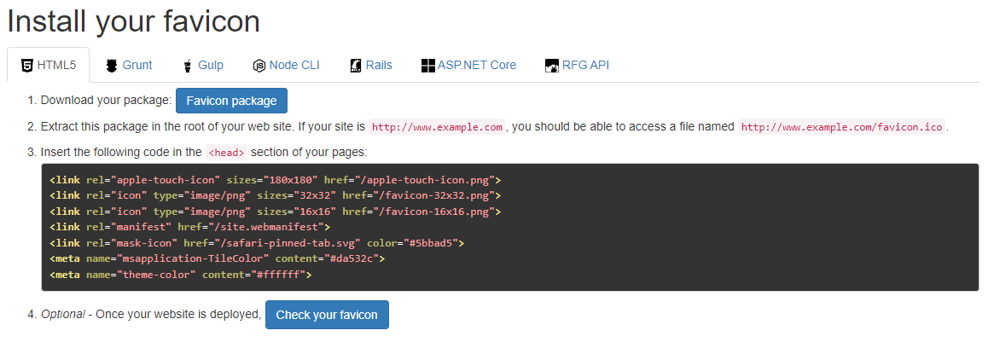
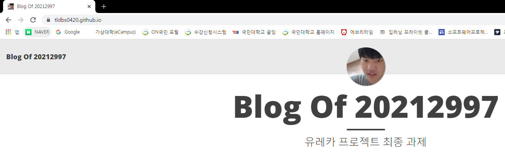

favicon은 웹 브라우저 주소창에 표시되는 웹페이지의 대표 아이콘이다. 이를 구현하기 위해 다음 블로그를 참고하였다.
> https://velog.io/@eona1301/Github-Blog-%ED%8C%8C%EB%B9%84%EC%BD%98Favicon-%EC%84%B8%ED%8C%85%ED%95%98%EA%B8%B0

우선 favicon에 쓸 사진 먼저 찾기로 했다.

나의 이 사진으로 만들기로 결정하였다.
favicon을 만드는건 쉽다. [realfavicongenerator](https://realfavicongenerator.net/)에서 사진을 업로드하면 다음과 같은 페이지가 나온다.

여기서 Favicon package를 다운받는다. 이 내용물을 담기 위해 assets 폴더 안에 logo 폴더를 만들었다. 이 안에 다운받은 내용물을 넣었다. 이후에 저 코드를 경로만 맞게 수정해주고 적절한 곳에 넣어야 한다. 나는 이걸 _includes 폴더 안에 있는 header.html에 넣기로 했다. header면 제일 먼저 호출될거라 생각했기 때문이다. 따라서 다음과 같이 수정하고 넣었다.
```
...

  <link rel="apple-touch-icon" sizes="180x180" href="{{site.baseurl}}/assets/logo/apple-touch-icon.png">
  <link rel="icon" type="image/png" sizes="32x32" href="{{site.baseurl}}/assets/logo/favicon-32x32.png">
  <link rel="icon" type="image/png" sizes="16x16" href="{{site.baseurl}}/assets/logo/favicon-16x16.png">
  <link rel="mask-icon" href="{{site.baseurl}}/assets/logo/safari-pinned-tab.svg" color="#5bbad5">
  <meta name="msapplication-TileColor" content="#da532c">
  <meta name="theme-color" content="#ffffff">

</head>
```
사진을 넣는 김에 assets 폴더 속 img 폴더 안에 있는 프로필 사진인 avatar-icon.png도 위의 사진으로 수정하였다. 그 결과는 다음과 같다.

favicon이 잘 적용된 모습이다.